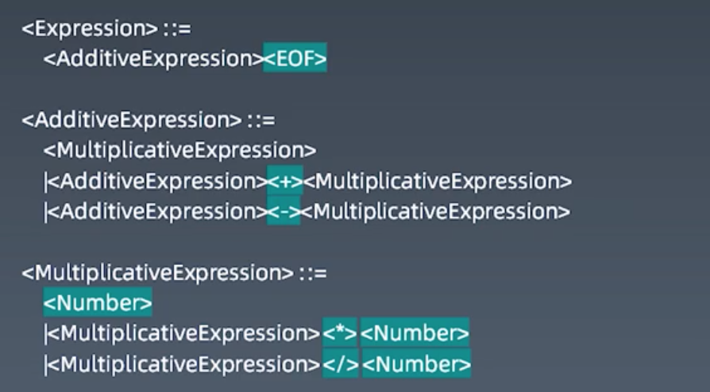

# 学习笔记

* AST抽象语法树  LL left left算法
* `function*`生成器函数，可以用`for...of`迭代自动调用生成器的`next`方法

[RegExp.prototype.exec() - JavaScript | MDN](https://developer.mozilla.org/zh-CN/docs/Web/JavaScript/Reference/Global_Objects/RegExp/exec)
`exec()` 方法在一个指定字符串中执行一个搜索匹配。返回一个结果数组或`null`。
在设置了 global 或 sticky 标志位的情况下（如 `/foo/g` or `/foo/y`），JavaScript RegExp 对象是有状态的。他们会将上次成功匹配后的位置记录在 `lastIndex` 属性中。使用此特性，`exec()` 可用来对单个字符串中的多次匹配结果进行逐条的遍历（包括捕获到的匹配），而相比之下， `String.prototype.match()` 只会返回匹配到的结果。
