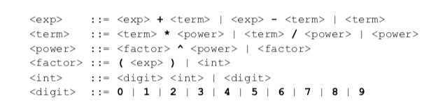

# 学习笔记

## 语言按语法分类

* 非形式语言
  
  中文，英文

* 形式语言（乔姆斯基谱系）

> 计算机科学中刻画形式文法表达能力的一个分类谱系，是由语言学家诺姆·乔姆斯基于1956年提出的

  0型 无限制文法

  1型 上下文相关文法

  2型 上下文无关文法

  3型 正则文法

## 产生式（BNF 巴科斯-诺尔范式）

用尖括号括起来的名称表示语法结构名

语法结构分成基础结构和需要用其他语法结构定义的复合结构

  基础结构称终结符 terminal symbol

  复合结构称非终结符 nonterminal symbol


引号和中间的字符表示终结符
可以有括号  
`*` 重复多次  
`|` 或  
`+` 至少一次  
尖括号 `< >` 内包含的为必选项；  
方括号 `[ ]` 内包含的为可选项；  
大括号 `{ }` 内包含的为可重复0至无数次的项；  
圆括号 `( )` 内包含的所有项为一组，用来控制表达式的优先级；  
竖线 `|` 表示在其左右两边任选一项，相当于"OR"的意思；  
`::=` 是“被定义为”的意思；  
`...`  表示术语符号；  

> 小节练习

```
<AdditiveExpression>::= 
  <MultiplicativeExpression>
  |<AdditiveExpression><+><MultiplicativeExpression>
  |<AdditiveExpression><-><MultiplicativeExpression>

<MultiplicativeExpression>::=
  <PrimaryExpression>
  |<MultiplicativeExpression><*><PrimaryExpression>
  |<MultiplicativeExpression></><PrimaryExpression>

<PrimaryExpression>::= (<AdditiveExpression>) | <Number>
```

> 这个刚好在网上看到一个参考



## 语言分类

> 小节练习

形式语言——用途

  数据描述语言 JSON, HTML, CSS, SGML, XML, sql

  编程语言 C, Java, C++, Python, Ruby, Perl, Lisp, Clojure, Haskell, JavaScript...

形式语言——表达方式

  声明式语言 JSON, HTML, CSS, SQL, XAML, Lisp, Clojure, Haskell...

  命令型语言 C, C++, Java, c#, Python, Ruby, Perl, JavaScript

## 编程语言的性质

图灵完备性

  命令式——图灵机
    goto
    if和while

  声明式——lambda
    递归

动态与静态

类型系统

动态类型系统与静态类型系统  
强类型遇弱类型   
复合类型  
子类型  
泛型  

## 一般命令式编程语言

Atom原子  
Identifier,Literal  

Expression表达式  
Atom,Operator,Punctuator  

Statement语句  
Expression,Keyword,Punctuator  

Structure结构  
Function,Class,Process,Namespace  

Program    
Program,Module,Package,Library

> 乔姆斯基谱系：是计算机科学中刻画形式文法表达能力的一个分类谱系，是由诺姆·乔姆斯基于 1956 年提出的。它包括四个层次：
  0- 型文法（无限制文法或短语结构文法）包括所有的文法。
  1- 型文法（上下文相关文法）生成上下文相关语言。
  2- 型文法（上下文无关文法）生成上下文无关语言。
  3- 型文法（正规文法）生成正则语言。  
  巴科斯诺尔范式：即巴科斯范式（英语：Backus Normal Form，缩写为 BNF）是一种用于表示上下文无关文法的语言，上下文无关文法描述了一类形式语言。它是由约翰·巴科斯（John Backus）和彼得·诺尔（Peter Naur）首先引入的用来描述计算机语言语法的符号集。

  图灵机（Turing machine）：又称确定型图灵机，是英国数学家艾伦·图灵于 1936 年提出的一种将人的计算行为抽象掉的数学逻辑机，其更抽象的意义为一种计算模型，可以看作等价于任何有限逻辑数学过程的终极强大逻辑机器。

  图灵完备性：在可计算性理论里，如果一系列操作数据的规则（如指令集、编程语言、细胞自动机）可以用来模拟单带图灵机，那么它是图灵完全的。这个词源于引入图灵机概念的数学家艾伦·图灵。虽然图灵机会受到储存能力的物理限制，图灵完全性通常指“具有无限存储能力的通用物理机器或编程语言”。

  终结符： 最终在代码中出现的字符（ https://zh.wikipedia.org/wiki/ 終結符與非終結符)

  产生式： 在计算机中指 Tiger 编译器将源程序经过词法分析（Lexical Analysis）和语法分析（Syntax Analysis）后得到的一系列符合文法规则（Backus-Naur Form，BNF）的语句

  静态和动态语言： https://www.cnblogs.com/raind/p/8551791.html

  强类型： 无隐式转换

  弱类型： 有隐式转换

  协变与逆变： https://jkchao.github.io/typescript-book-chinese/tips/covarianceAndContravariance.html


## JS类型

类型

Number 

String 

Boolean 

Object 

Null 有值但为空 

Undefined 未赋值 

Symbol 用于object属性名 

### Number

双精度浮点类型 IEEE754 Double Float

Sign（1）符号 0正 1负 

Exponent（11）指数 

Fraction（52）精度 

精度损失

十进制 
`0` 
`0.` 
`.2` 
`1e3` 

```JavaScript
0.toString()
// Uncaught SyntaxError: Invalid or unexpected token
0 .toString()
// '0'
```

二进制
0b111

八进制 
0o10

十六进制 
0xFF

### String

计算机中用code point表示character

* ASCII  
0~127 规定了128个字符的编码

* Unicode  
所有符号的编码

* UCS

* GB  
  GB2312，GBK，GB18030 大全版本

* ISO-8859 

* BIG5 


UTF8 
UTF16 

> 小节练习...

```JavaScript
function UTF8_Encoding(str) {
  return new TextEncoder().encode(str);
}
```

### Boolean

true false

### Null Undefined

null 关键字 

undefined 全局变量 

void 0 

## 对象

任何一个对象都是唯一的，与状态无关  
状态完全一致的两个对象也并不相等  
用状态描述对象，状态的改变即是行为  

state, identifier, behavior

归类和分类是两个主要流派  归类 例如 c++ 分类 例如js

> 小节练习

```JavaScript
// error bite对狗的状态并没有影响
class Dog {
  bite(human) {

  }
}

// 设计对象状态和行为时，我们总是遵循“行为改变状态”的原则
class Human {
  hurt(damage) {
    
  }
}

```


特殊对象行为

> Array：Array 的 length 属性根据最大的下标自动发生变化。  
  Object.prototype：作为所有正常对象的默认原型，不能再给它设置原型了。  
  String：为了支持下标运算，String 的正整数属性访问会去字符串里查找。  
  Arguments：arguments 的非负整数型下标属性跟对应的变量联动。  
  模块的 namespace 对象：特殊的地方非常多，跟一般对象完全不一样，尽量只用于 import 吧。  
  类型数组和数组缓冲区：跟内存块相关联，下标运算比较特殊。  
  bind 后的 function：跟原来的函数相关联。  