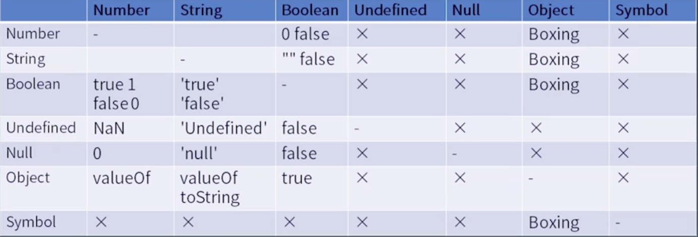
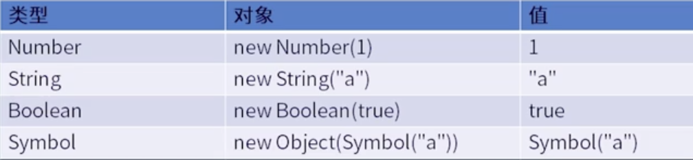

# 学习笔记

## Expressions

### Member

```
a.b
a[b]
foo\`string\`
super.b
super['b']
new.target
new Foo()
```

### New

new Foo

```
new a()()
new new a()
```

Reference类型


### Call

```
foo() 
super()
foo()['b']
foo().b
foo()`abc`
```

### Left Handside  Right Handside

a.b = c;  
a + b = c;

### Update

Right Handside Expression

```
a ++
a --
-- a
++ a

```

### Unary

```
delete a.b
void foo()
typeof a
+ a
- a
~ a
!a
await a
```

### Exponental

`**` 右结合

### Multiplicative

` * / % `

### Additive

` + - `

### Shift

` << >> >>> `

### Relationship

` < > <= >= instanceof in `

### Equality

```
==
!=
===
!==
```

### Bitwise

```
& ^ |
```

### Logical

` && || `

### Conditional

` ?: `


### 类型转换 Type Convertion

`a + b`

最复杂的类型转换：双等号 `"false" == false`

`a[o] = 1`



### 拆箱转换 Unboxing

ToPremitive

toString vs valueOf

Symbol.toPrimitive

```
var o = {
  toString() { return "2" },
  valueOf() { return 1 },
  [Symbol.toPrimitive]() { return 3 }
}
```

如果定义了Symbol.toPrimitive就会忽略toString和valueOf；加法优先valueOf，o作为属性名的时候会优先toString，转Number先调用valueOf，用到字符串的场景会先调用toString

### 装箱转换 Boxing

* 使用typeof去区分是包装后的对象还是之前的值



StringToNumber  
NumberToString


## 语句 Statement

Grammar

简单语句  
组合语句  
声明  

Runtime

Completion Record语句执行结果记录    
Lexical Environment作用域

```
if (x == 1)
  return 10;
```

* `[[type]]` normal,break,continue,return,throw
* `[[value]]` 基本类型
* `[[target]]` label


### 简单语句和复合语句

简单语句 

* ExpressionStatement
* EmptyStatement
* DebuggerStatement
* ThrowStatement
* ContinueStatement
* BreakStatement
* ReturnStatement

复合语句

* BlockStatement
* IfStatement
* SwitchStatement
* IterationStatement
* WithStatement
* LabelledStatement
* TryStatement


## 声明

* FunctionDeclaration
* GeneratorDeclaration
* AsyncFunctionDeclaration
* AsyncGeneratorDeclaration
* VariableStatement
* ClassDeclaration
* LexicalDeclaration(const let)

预处理机制


## 执行上下文 Execution Context

* 执行一个语句时所需要的所有信息都会保存在Execution Context中
* 保存Execution Context的数据结构就是Execution Context Stack
* 当执行到当前语句时，会有一个栈顶元素，就是我们当前能访问到的所有变量，被称为Running Execution Context

Execution Context：

* code evaluation state 用于async和generator函数，保存代码执行到哪的信息
* Function
* Script or Module
* Generator Generator函数每次执行所生成的隐藏在背后的Generator，只有Generator函数创建的执行上下文会有该字段
* Realm
* LexicalEnvironment
* VariableEnvironment

