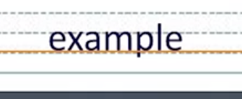
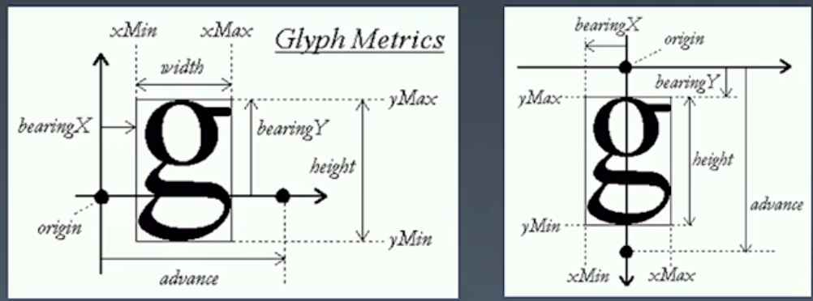
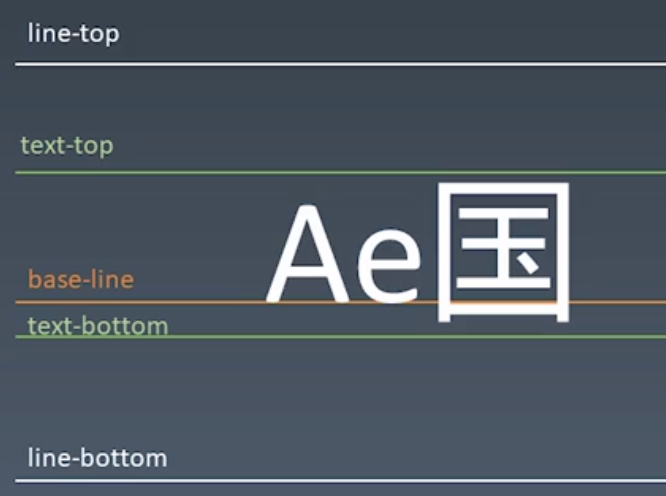
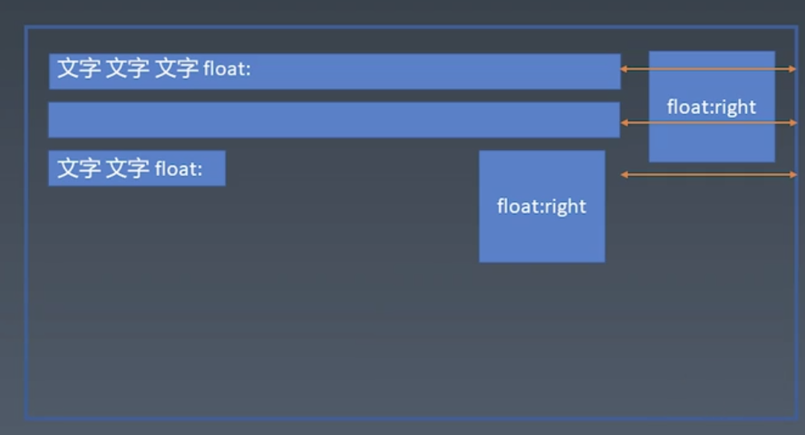
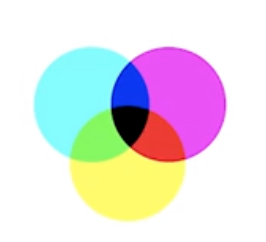
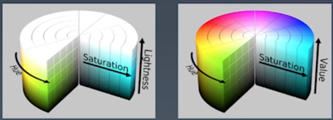

# 学习笔记

### Baseline  

### Text

### 行模型

### float clear 

### 正常流只有BFC会发生margin collapse

## Block

* Block Container 里面有BFC  

block,inline-bloc,table-cell,flex item,grid cell,table-caption

* Block-level Box 外面有BFC

* Block Box = Block Container + Block-level Box 里外都BFC

## 设立BFC Establish BFC

* floats
* absolutely positioned elements
* block containers that are note block boxes
  * inline-blocks
  * table-cells
  * table-captions
  * flex items
  * grid cell
* block boxes with 'overflow' other than 'visible'

## BFC合并

block box && overflow:visible
  * BFC合并与float
  * BFC合并与边距折叠

## 颜色

CMYK RGB 

HSL HSV

Hue色相

Saturation 纯度

Lightness 0 黑色 100 白色  中间值 纯色

Value 100纯色

## 绘制

几何图形
  * border
  * box-shadow
  * border-radius

文字
  * font
  * text-decoration

位图
  * background-image

data uri + svg

